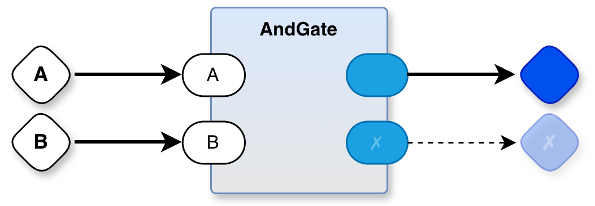

# Pong in PBP Cloning Original Atari Schematic
	

# usage:
`./@make`

# Source Code
- pong.drawio (edit using drawio editor)
- main.py kick-off
- and.py - simple test of AND gate meant to mimic operation of TTL like electronic IC
  - in electronics, signals persist, but in PBP, mevents (message events) are momentary
  - each mevent signals an "edge" - a change / update of the value on an input pin
  - we store the most recent value of each incoming mevent in a static variable (a field of a class instance) and re-evaluate the AND output (and send the new value out as a mevent from the AND part)
  
# expected output
For the initial test, we are sending False to both inputs and expect one False output.

In later tests, we will send 4 combinations of inputs and expect to see 4 output mevents.

# Further Reading
[Thinking About the Game of Pong](https://programmingsimplicity.substack.com/p/2024-07-17-thinking-about-the-game)
