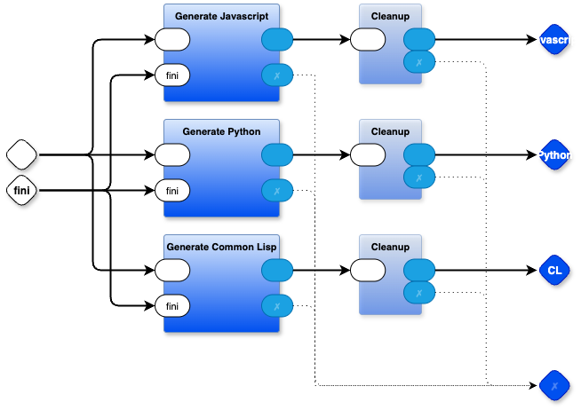

# Parts Based Programming (PBP)
This is a set of tools for building software using a Diagrammatic Programming Language (DPL).

The main code editor currently is draw.io (drawio.com). Theoretically, other editors, like Excalidraw, could be used by tweaking `das2json.mjs`.

A subset of the tools can also be used raw just for manipulating text. `T2T` is "text to text transmogrification".

PBP is bascially an asynchronous message passing programming language. PBP creates parts that are loosely coupled and can be used to snap programs together in a LEGO-like manner. Most textual programming languages, like Python, Javascript, Rust, etc. create functions that are too tightly coupled to allow easy composition in a LEGO-like manner (they only fool you into thinking that you can do LEGO-like composition via functional composition, but this devolves into head-scratching and bloat due to the implicit tight coupling of functions).

The main tools are the subdirectories
- kernel
- das
- t2t

where 
- _das_ means *diagrams as syntax*
- _t2t_ means _text to text_ transmogrification ("transpiling", "compiling", "macros")
- _kernel_ is the implementation of an asynchronous-message-passing kernel between Parts (Leaf and Container)

# Usage
`git clone https://github.com/guitarvydas/pbp`

This gets you the whole directory structure, suitable for maintaining the PBP tools.

To simply _use_ the tools, run one of the scripts below to prune files out and to copy customizable files up to the current working directory (see below).

## For PBP toolset usage
`./pbp/@setup-pbp.sh`
manually modify `@makec`, `@defc` and `@testc` for the current project (note that `@make` is generic and calls the `*c` (custom) scripts as required for building the project)

## For T2T subset usage
`./pbp/@setup-t2t.sh`
manually modify `@makec`, `@defc` and `@testc` for the current project (note that `@make` is generic and calls the `*c` (custom) scripts as required for building the project)

aside: cloning the tools on a per-project basis tends to alleviate the "version hell" problem. The tool files are not very big and there is no need to share them across projects and, consequently, worrying about versioning. We no longer need to conserve disk space like back in the stone age.

To build a project, use `./@make`. We no longer need the complication of using a `Makefile`, we just need to set up some environment variables and run some scripts.

The PBP tools can be used to build more tools that can be used in other projects. Tools built this way tend to be composed of multiple executables and scripts. Environment variables are adjusted for the two main use-cases: (1) top level build of the tool along with testing the tool and (2) using the tool as a sub-tool from another project.

The two use-cases are differentiated by the number of command line arguments passed into `@make`
## Top Level Build
`@make`

## Call Tool From Another Project
`@make <sub-tool working directory> <basename of the caller's file to be processed> <caller's working directory>`

Note: this style of usage is likely to change, but, since you made a complete local copy of the toolset, you don't need to worry about future updates.

Note: the problem with this style of usage is that the caller's `@makec` must hard-wire the `<sub-tool working directory>` into its script code. This creates a hard dependency in the calling code. I'm working on a way to automagically create trampoline scripts, placed on $PATH, that contain the actual hard-coded paths so that this hard-wiring can be removed from calling scripts. (IIUC, `npm` already does something like this).

Note: these scripts run on *NIX systems like Linux and MacOS, but need to be rewritten to work on Windows. A more portable option might be to use Python instead of `*sh` scripts. These days, LLMs can be used to rewrite `*sh` scripts into Python, so I'm sticking with `*sh` scripts for now (`*sh` scripts are more readable than Python versions of the same thing). Maybe I'll just put Python versions into this directory alongside the `*sh` scripts, generated from the `*sh` scripts? I haven't done that yet. Of course, Windows users could simply generate Python versions of the scripts. [Suggestions, collaborators welcome].

## Environment Variables for Debugging
If you want more debugging info, define these variables in your `@defc` script:

PBPSTEPPING - if defined, kernel will print the name of each part that is being stepped

T2TVERBOSE - if defined, t2t rewriter will print the name of every rewrite rule on entry and exit

# Further Reading / Viewing
[Towards Parts Based Programming](https://www.youtube.com/watch?v=IFcIptdG2sY&list=PLHh2_dCKBPjYBmubkBfn0LSbDMRKsr9Ui)
[PBP cookbook playlist](https://www.youtube.com/watch?v=EFTzFA82YRc&list=PLHh2_dCKBPjbBN2R8xwBiS4nHlo5iQjqS)
[Decision Tree Diagram Transmogrifier](https://www.youtube.com/playlist?list=PLHh2_dCKBPjYhpvWSvJNJdrsZE8lNHza7)
[State Machine Diagram Tool](https://www.youtube.com/watch?v=ecJGkrpUhQQ&list=PLHh2_dCKBPjZEvCymkt1ZVualP7gt3e1O&index=17)

[FDD LLM - 5 Whys Tool - code repository](https://github.com/guitarvydas/fdd-llm)
[State Machine Tool - code repository](https://github.com/guitarvydas/sm-pbp)
[Decision Tree Tool - code repository](https://github.com/guitarvydas/dtree)
[PBP all tools (PBP, T2T, das2json)](https://github.com/guitarvydas/pbp)

# TL;DR - Details

## Kernel
A blob of code that implements asynchronous message-passing using two types of parts:

* Container parts: a way to recursively bundle parts and treat programming in a LEGO block manner.
* Leaf parts: code in the traditional sense, asynchronous.

The kernel code is written in a meta language (.rt) and the compiler is implemented as drawware (see kernel.drawio).

The original kernel was implemented in Odin by Zac Nowicki. Over time, it was moved to Python, then to .rt.

The kernel compiler generates kernels in three different languages—Python, JavaScript and Common Lisp. It is likely that it could be easily modified to generate code for other languages.
## DaS
Contains a program, das2json.mjs, that converts .drawio files to JSON while removing the majority of redundant graphics rendering information.

Originally written by Zac Nowicki as an Odin program that utilized an off-the-shelf XML parsing library, the current version is written in Node.js. Working versions of das2jon have been written in t2t, but are not yet included here.
## T2T
This subdirectory contains a text-to-text transmogrification program.  

The front end uses OhmJS to parse input grammars.

The back end uses a simple DSL (I refer to it as an SCN[^scn]) RWR that contains rules for rewriting parses of the input. Documentation for RWR can be found in [RWR Spec](RWR%20Spec.pdf). Under the hood, t2t runs OhmJS twice and combines the results using files in `t2t/lib`.

The `pbp/t2t.bash` script[^scr] performs the necessary work to run a transmogrification. The script requires six arguments:

1. The current working directory (typically `.`)
2. The path to the pbp toolset (typically `./pbp`)
3. The name of a grammar file
4. The name of a rewrite rule file
5. The name of a node.js file containing support functions (typically empty, sometimes containing one or two short JavaScript functions, each of which is a few lines long (examples  can be found in the `pbp/examples` subdirectories)
6. The name of an input source file to be transmogrified (or - to signify stdin)

[^scn]: SCN ≡ Solution Centric Notation.
[^scr]: This script is used in many drawware components in the toolset. You can find these by looking at drawings that have the string `:$ ./t2t.bash ...` in them.

---

## Using the Tools for Programming Projects
aside: This is a link to an older style of setup. It should still work. I will create a new video and change this section at some point in the future.

Instructions and video in another repo: [hello world from first principles](https://github.com/guitarvydas/pbp_helloworld)

## Mevent Flow Basics
[mevent flow basics](https://www.youtube.com/watch?v=yPg4wVRQfYE&list=PLHh2_dCKBPjbBN2R8xwBiS4nHlo5iQjqS&index=2)

## Philosophy Corner
Computers are not merely “better paper,” yet we continue to program them using notations intended for use on paper, a practice that dates back to the 1960s.

A significant advancement in programming language (PL) design occurred in the early 1970s with the invention of UNIX pipes[^p], but this innovation was largely ignored and conflated with the concept of “operating systems” rather than “programming languages.”

Traditional PLs enabled the creation of single-threaded programs using syntaxes that were considered superior to assembler and machine code. Additionally, linters[^tc] were integrated directly into PLs rather than being developed as separate tools.

We were able to use such sequential, synchronous PLs for decades because we could not afford to build computers with numerous small CPUs. Today, we can afford to do so (with devices like Arduinos, ESP32 and Raspberry Pis), yet we continue to operate with a single-threaded mindset due to inertia. This is evident in our perception of “concurrency” as a complex and challenging issue[^c].

Single-threaded languages handled multi-threading by adopting time-sharing concepts and implicitly the concept of shared memory for multiple threading. This led to various workarounds to manage the inadvertently created complexity of “thread safety,” which would not have been an issue if computers had been built with multiple CPUs connected by thin wires.

Today, we have computer networks composed of countless CPUs, computers and nodes connected by thin wires. However, we allow momentum to dictate our approach by using programming languages originally designed for single-threaded thinking and workarounds such as time-sharing. IoT, robotics, the internet, NPCs in gaming, and more abound, yet we attempt to force them into calculator or clockwork designs.

PBP emerged from 0D (zero dependency, i.e., asynchronous message passing) and represents a baby step towards defining new-breed PDEs[^pde] for the 21st century.

Surprisingly, existing tools for parsing one-dimensional textual languages are quite capable of parsing two-dimensional diagrammatic languages (and, likely, visual programming languages as well). Modern diagram editors such as Drawio, Excalidraw, yEd, and others compress two-dimensional diagrams into one-dimensional textual form (e.g., XML or GraphML). These textual formats are considered unreadable by humans but are highly readable by machines and existing parsing technologies. PEG, particularly OhmJS, simplifies the automated construction of parsers significantly compared to older CFG-based techniques. Consequently, we do not need to develop graphical editors for diagrammatic or visual programming languages. We can begin by utilizing existing tools. This is precisely the purpose of `das2json`.

Older techniques from compiler research, such as Fraser/Davidson peepholing, Cordy’s Orthogonal Code Generator, backtracking, and staged computation, can be revived and applied to more modern problem domains.

Concepts based on biases towards premature optimization can be reconsidered. For instance, the very concept of user-defined “data structures” is merely an optimization for the fact that we would have preferred ubiquitous pattern-matchers that could destructure data on an as-needed basis. We simply lacked the resources to implement such a system in the 1970s. Perhaps we can now?

Early compilers operated in a staged manner, streaming input and transpiling one form of text (HLL syntax) into another (assembler syntax). Examples of such compilers include PT Pascal and its derivatives such as Concurrent Euclid, Turing, and others. 

Furthermore, in the early days, it was generally considered laughable to work with variable-length strings. However, today, we are aware of (decent) garbage collection and simple concepts such as string interpolation[^t]. The `t2t` tool facilitates the parsing and rewriting of strings[^po].

As far as I can determine, there are only a few key considerations. We can implement these ideas using modern programming languages and begin using them immediately without waiting for new languages.

- Pure Message-Passing and Asynchronous Execution:
  - Functions are inherently synchronous, which is the opposite of asynchronous.
  - Use queues instead of stacks.

- Ports:
  - Ports should be well-defined input and output points on each part.
  - Similar to kindergarten, avoid crossing boundaries between parts (software units) except at well-defined ports.
  - If you need to manage “global variables” or “captured, closed-over variables,” consider using a notation that provides true isolation between software units while maintaining synchronous operation of their internals. This approach should be less bloated than what “operating systems” have become.

- Recursive Nesting and Bundling:
  - This concept is implemented in `Forth` and `/bin/*sh`.
    - `Forth` uses double-indirection, while `/bin/*sh` uses Greenspunian double-indirection involving forks.
  - In pure message-passing[^mp], there is implicitly the concept of moving data from one place to another. A simple pair `{sender, receiver}` can describe such a connection. To implement nesting, extend this to a triple `{direction, sender, receiver}`, where direction can be `[down|across|up|through]`. Down and up can be implemented by having Container Parts punt messages to/from inner Parts.

# Semantics 

# Layering and Abstracting
## Fan-Out
Fan-out is necessary for DX ([article](https://programmingsimplicity.substack.com/p/layered-abstraction?r=1egdky))

## Control For Layering

## First Class Mevent Sending and First Class Functions
We need to use a programming language/notation that makes it equally easy to use asynchronous message sends and function calls, so that we may choose appropriately. It is not good enough to make function calls convenient, but, to require extra work to enact async message sending.

[^p]: UNIX drew inspiration from earlier systems, but it made the concept of pipes accessible to a broader audience.
[^tc]: Type checkers are synonymous with linter tools. Rather than creating separate tools, we permitted the needs of type-checking linters to influence the syntax of our programming languages with type annotations and numerous restrictions that facilitated linting at the expense of making programming more difficult. Ironically, a language for linting, Prolog, was developed early on but was largely ignored by compiler writers who opted to manually implement type checking into compiler implementations.
[^c]: Concurrency is ubiquitous. Humanity has developed numerous protocols for managing concurrent events, such as shaking hands and adhering to meeting schedules. I even taught my five-year-olds how to handle challenging real-time situations, such as piano lessons and sheet music.
[^pde]: Program Development Environment, formerly known as IDEs, comprises programming languages, operating systems, text editors and other software.
[^t]:. It would be worthwhile to revisit TCL, SNOBOL and Icon.
[^po]: The concept of simply transforming strings into other strings without the need for all the other complex features we have so diligently developed appears preposterous at first glance. However, this is merely an example of “premature optimization” thinking. I have been using t2t for several years to create new languages (such as for the kernel itself) and have not found it necessary to complicate matters further.
[^mp]: Pure message passing is akin to transmitting data through a tube. In contrast, impure forms of message passing involve calling methods and blocking while awaiting a returned answer. This blocking implicitly transfers control flow, in addition to passing the data.
